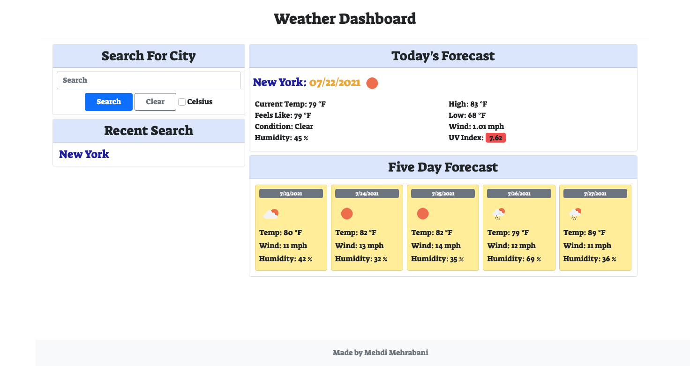

# legendary-meme

Assignment: Weather Dashboard

Developer: Mehdi Mehrabani

For this week, we were tasked with building a Weather Dashboard that allows a user to look up the current weather for any city. The main purpose of this assignment was to further enhance our knowledge of Server-Side APIs and using localStorage to store any persistent data.

In the week prior, we learned how to use the Fetch API method to access API data.

1. Definition of Fetch API per MDN Web Docs:

> "The Fetch API provides a JavaScript interface for accessing and manipulating parts of the HTTP pipeline, such as requests and responses. It also provides a global fetch() method that provides an easy, logical way to fetch resources asynchronously across the network."

MDN Web Docs link [Using Fetch](https://developer.mozilla.org/en-US/docs/Web/API/Fetch_API/Using_Fetch)

The two links below were provided to read prior to beginning the assignment.

1. Overview of how to use API keys. [Full-Stack Blog on how to use API keys](https://coding-boot-camp.github.io/full-stack/apis/how-to-use-api-keys)

2. Specifics when retrieving data from OpenWeather API. [OpenWeather One Call API](https://openweathermap.org/api/one-call-api)

## ASSIGNMENT SUMMARY

The requirements for completing the App assignment were the following.

1. When you search for a city:

   a. The city searched is added to a search history list.

   b. The current and five day forecast is presented.

2. Current City Data

   a. City Name + Date + Weather Condition Icon + Temperature + Humidity + Wind Speed + UV Index

   b. The UV index needs to be colored to represent whether conditions are favorable, moderate, or severe.

   c. When user refreshes page, the saved events are not lost..

3. Five Day Forecast

   a. Date + Weather Condition Icon + Temperature + Humidity + Wind Speed

   b. The UV index needs to be colored to represent whether conditions are favorable, moderate, or severe

4. Search History City Click Functionality

   a. When user clicks on any of the saved city, they are presented with the data discussed above.

## Process of Writing Code

# Image Of Final Assignment

